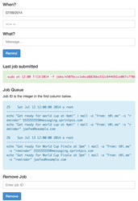

zoopaz-reminders
================

A simple webapp that interfaces with the UNIX at command to send simple email notifications. Use a carrier email address for text messages.

Setup
=====

1
-

Add similar lines to `/etc/sudoers` so that your webserver user can execute the `at`, `atq` and `atrm` commands.

    ALL ALL=NOPASSWD: /usr/bin/at
    ALL ALL=NOPASSWD: /usr/bin/atq
    ALL ALL=NOPASSWD: /usr/bin/atrm

2
-

Copy `example.config.php` to `config.php`.

1. Add all of the email address for which you want to receive notifications to the `$emails` array.

2. Update `$timezone` to one of the accepted values at [http://us3.php.net/manual/en/timezones.php](http://us3.php.net/manual/en/timezones.php).

If you use a carrier email to text address you can send text messages easily. Here's a large list of carriers and the format.

[http://www.emailtextmessages.com/](http://www.emailtextmessages.com/)

Screenshot
==========

Click thumbnail for full-size screenshot.

